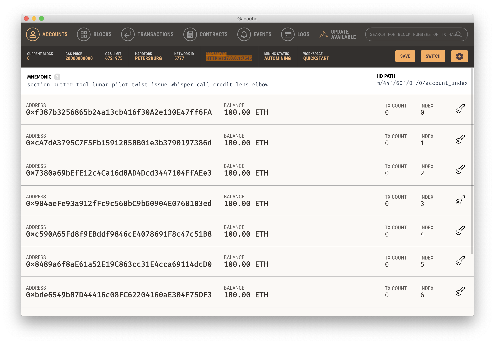
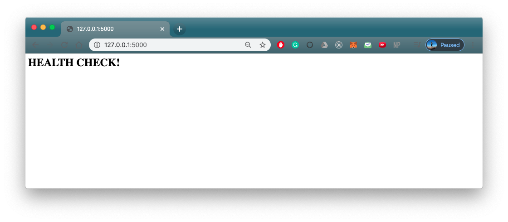
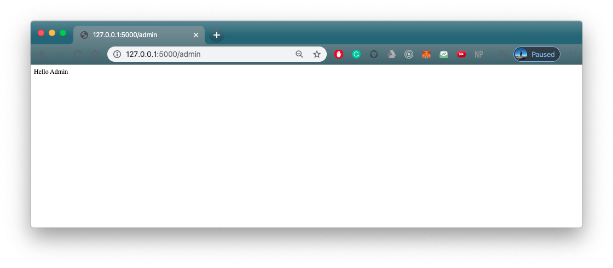

# Goals:
1. Understand what happens in a smart contract, in relation to Ethereum Main net/Ganache
2. Learn how to write a basic smart contract on remix.ethereum.org
3. Deploy a contract in a variety of ways (from remix.ethereum.org UI and python code)
4. Understand how to integrate python with smart contracts.

## Installations and Dependencies:
* `Ganache` installed (https://www.trufflesuite.com/ganache)
* Python 3.6+
* `Web3` python package (available with `pip install web3`)
* Flask (`pip install Flask`)

## Other dependencies for Deploying to Heroku
* gunicorn


## Usage:

To get started locally,
1. Ensure you have all installed all installations and dependencies.
2. Open a new terminal at a folder you want the demo to be storeed. Then, clone the repo and find Spring 2020.
```bash
git clone https://github.com/JustinRWong/IEOR185-Disruptive-Tech-and-Social-Impact.git
cd 2020_Spring/app
```
3. Open Ganache and check the Ganache RPC Server aligns with `ganach_url` in app.py

4. Simply run `python3 app.py`


Doing so will start the Flask server and the following endpoints will be available for usage.

| [](app/app.py#L138-L140)  | [](app/app.py#L138-L1) | [](app/app.py#L142-L144)
|:---:|:---:|:---|
| Health Check at http://127.0.0.1:5000/ to ensure that your Flask server  is up and running | Raw Admin at http://127.0.0.1:5000/admin  to show that raw text can be rendered using app.route('/admin') | Guest User at http://127.0.0.1:5000/guest/justin example page to show that you can parameterize endpoints with the app.route('/guest/<guest>') by including the VAR in `<VAR>

- http://127.0.0.1:5000/user/admin and http://127.0.0.1:5000/user/nonadmin are endpoints to show that login can be implemented to redirect endpoints based on the URL.

- http://127.0.0.1:5000/login is a route with both GET and POST capabilities
      - The GET renders the page on a broswer, while POST is called after the `submit` button is clicked
      
| [](app/app.py#L161-L169)  | [](app/app.py#L161-L169) |
|:---:|:---:|
| With Bootstrap | WithBootstrap |

- http://localhost:5000/success/Justin is the result of the POST call to http://127.0.0.1:5000/login after filling out the form.
      - This page has been modified since the lecture to include some styling to center align the page
###  Screenshot here

##  Summary  
The Demo here is primarily focused on how to connect a front end with executing a smart contract in the backend. We use Flask to render all pages and Web3 to handle the transactions on our blockchain network(Ganache in this case, though this can be a live blockchain network like ETH or OmiseGo). 

Once a User is logged in, the Sender fills out a form, specifying the `Sender Address` along with the `Sender Private Key`, the `Recipient Address`, and the `Amount` to be sent.

When Sender clicks on the Send ETH, their transaction is executed immediately on the Ganache local blockchain network,  without waiting for a third party to take up the contract and spend processing power to verify and execute the transaction, which is what would typically happen on the Ethereum Main Net.


###############################################

## Further Work:
### Deploying the basic application on Heroku\
1. Deploying to Heroku requires multiple files:
   - Procfile
   - runtime.txt
   - requirements.txt
   - wsgi to render the Flask sight

#### This part is not completed.
